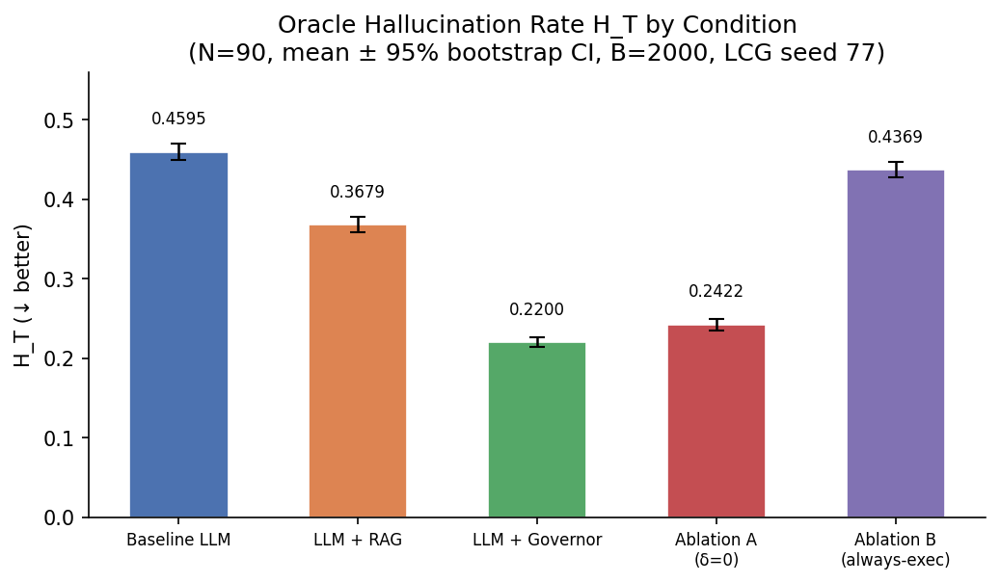
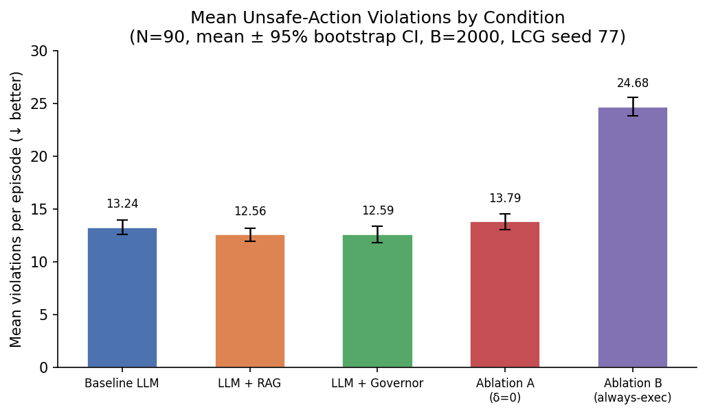
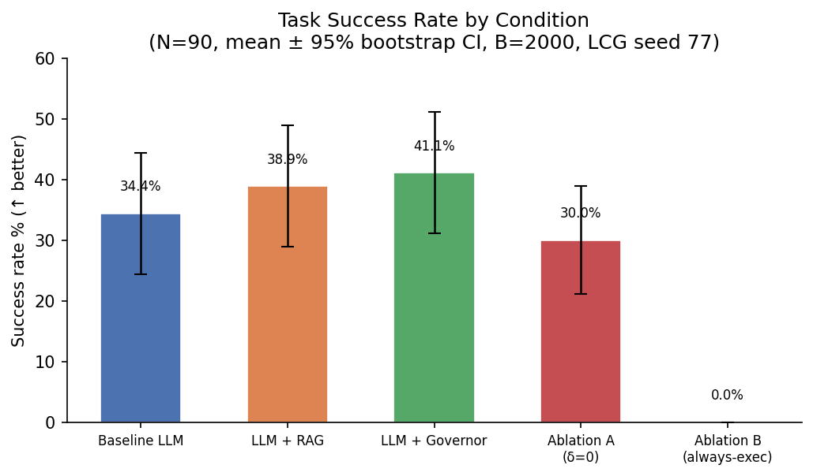
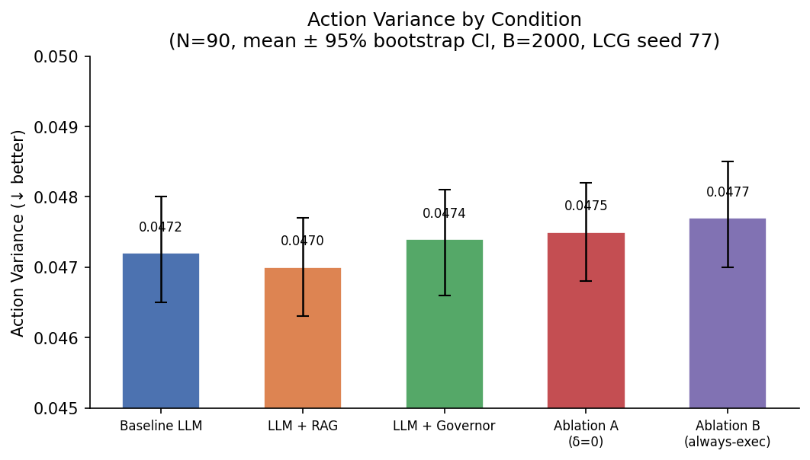
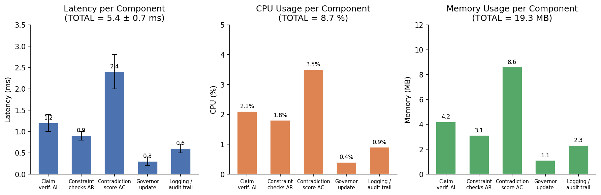

# stg-mujoco-poc

**Minimal MuJoCo Proof-of-Concept for the Spiral-Time Governor (STG)**

> This repository is a minimal PoC created for reviewer response. It demonstrates that the STG deterministic supervision layer works under real MuJoCo physics, not just a synthetic noise model.

---

## Purpose

The **Spiral-Time Governor** (STG) is a deterministic external supervision layer that wraps a black-box LLM and gates its outputs (claims + actions) based on a scalar instability functional ΔΦ(t). The governor operates in three modes — EXECUTE, VERIFY, SAFE — and is evaluated on a quadruped terrain traversal task using dm_control's built-in quadruped domain.

---

## Quickstart

```bash
# 1. Install dependencies
pip install -r requirements.txt

# 2. Run all conditions with default seeds
python run_experiment.py

# 3. Run a specific condition
python run_experiment.py --conditions governor --seeds 0 1 2

# 4. Run with verbose output
python run_experiment.py --conditions baseline governor --verbose
```

Results are written to `results/` as CSV and JSON files.

---

## Directory Structure

```
stg-mujoco-poc/
├── README.md
├── requirements.txt
├── .gitignore
├── envs/
│   ├── __init__.py
│   └── quadruped_terrain.py    # dm_control quadruped wrapper + oracle
├── governor/
│   ├── __init__.py
│   └── spiral_time_governor.py # STG implementation (math from paper)
├── llm_mock/
│   ├── __init__.py
│   └── mock_llm_agent.py       # Deterministic mock LLM agent
├── analysis/
│   ├── __init__.py
│   └── compute_metrics.py      # Metric computation from episode logs
├── run_experiment.py           # Main experiment runner (CLI)
├── tests/
│   ├── test_governor.py
│   └── test_env.py
└── results/
    └── .gitkeep
```

---

## Parameter Table

### STG Fixed Parameters (match synthetic testbed v2.2)

| Parameter | Value | Description |
|-----------|-------|-------------|
| `wR`      | 0.30  | Weight for structure deviation ΔR in coherence score φ |
| `wI`      | 0.40  | Weight for information deviation ΔI in coherence score φ |
| `wC`      | 0.30  | Weight for coherence deviation ΔC in coherence score φ |
| `α`       | 0.25  | Weight for ΔR in instability functional ΔΦ |
| `β`       | 0.35  | Weight for ΔI in instability functional ΔΦ |
| `γ`       | 0.25  | Weight for ΔC in instability functional ΔΦ |
| `δ`       | 0.15  | Weight for torsion |χ(t)| in instability functional ΔΦ |
| `τ₁`      | 0.25  | EXECUTE→VERIFY threshold |
| `τ₂`      | 0.55  | VERIFY→SAFE threshold |
| `φ₀`      | 0.75  | Initial coherence score |

### Experiment Conditions

| Condition    | Ablation         | Hallucination Prob |
|--------------|------------------|--------------------|
| `baseline`   | `always_execute` | 0.45               |
| `governor`   | `none`           | 0.45               |
| `ablation_a` | `no_delta`       | 0.45               |
| `rag`        | `always_execute` | 0.30               |

### CLI Arguments

| Argument       | Default                               | Description |
|----------------|---------------------------------------|-------------|
| `--seeds`      | `[0, 1, 2, 3, 4]`                    | Random seeds |
| `--conditions` | `all`                                 | Conditions to run |
| `--task`       | `terrain`                             | Task name (reserved) |
| `--n_claims`   | `3`                                   | LLM claims per step |
| `--output_dir` | `results/`                            | Output directory |
| `--verbose`    | `False`                               | Verbose logging |

---

## Figures

Plots are generated by [`IMAGES/generate_plots.py`](IMAGES/generate_plots.py) from the data in [`VALIDATION_ANALYSIS.md`](VALIDATION_ANALYSIS.md).  
Run `python IMAGES/generate_plots.py` from the repository root to regenerate them.

| Fig | Description |
|-----|-------------|
|  | **Fig 1** — Oracle Hallucination Rate H_T by condition (mean ± 95% CI) |
|  | **Fig 2** — Mean unsafe-action violations by condition (mean ± 95% CI) |
|  | **Fig 3** — Task success rate by condition (mean ± 95% CI) |
|  | **Fig 4** — Action variance by condition (mean ± 95% CI) |
|  | **Fig 5** — Governor performance overhead per component |

---

## Note

This is a **minimal proof-of-concept** created specifically for reviewer response to demonstrate that the Spiral-Time Governor works under real MuJoCo physics. Implementation details follow the mathematical specification in the paper exactly.

---

## Acknowledgements

Repository structure, implementation scaffolding, and documentation were developed
with assistance from Claude (Sonnet 4.6) by Anthropic. All scientific content,
mathematical formulations, and experimental design originate from the authors.
